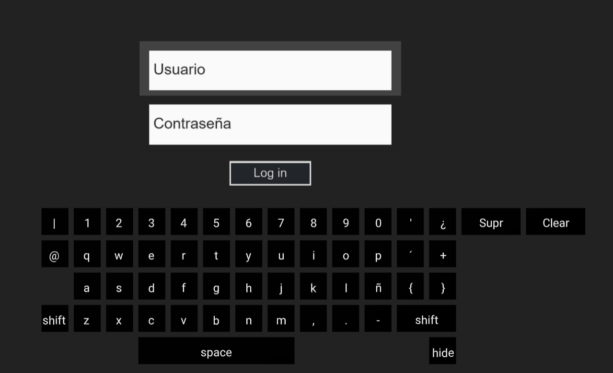

# A-Frame Keyboard

Teclado virtual

[A-Frame](https://aframe.io/) v0.9.2+.

### Atributos

| Nombre | Descripción | Default |
| --- | --- | --- | 
| keyColor | Color de la letra | #FFF |
| activeKeyColor | Color del cuadro de la tecla activa | #FF0 |
| letterColor | Color del cuadro de la tecla | #000 |
| shiftMayus | Booleano que determina si está activo el teclado con mayúsculas | 0 (false) |
| contUser | Booleano que determina si hay algún caracter en el campo ‘Usuario’ | 0 (false) |
| contPass | Booleano que determina si hay algún caracter en el campo ‘Contraseña’ | 0 (false) |
| soundSrc | Efecto de sonido al presionar alguna tecla | keySound.mp3 |

### Methods

| Name | Description |
| --- | --- |
| show() | Display the keyboard without any animations. |
| hide() | Hide the keyboard without any animations. |
| open() | Open the keyboard smoothly. |
| dismiss() | Close the keyboard smoothly. |
| destroy() | Remove the keyboard from the scene. |
